# Comprehensive Git Branching & Commit Log Specification

**Project:** Soter — On-Call Incident Escalation & Real-Time Health Monitoring System  
**Assessment:** B2B Cloud / Enterprise Software CA1  
**Team Members:**
1. **Aditya** (`aditya@soterstore.com`) — **Team Lead**: Systems Architecture, Team Management, Admin Console, Shared Utilities, Release Coordination & Docs.
2. **Ravish** (`ravish@soterstore.com`) — Core Backend, Storage Engine, Service Registry, Health Engine & Proxy Server, CSS Design System.
3. **Radhika** (`radhika@soterstore.com`) — Authentication & Multi-Tenant RBAC, Incident Lifecycle & Escalation Engine, Audit Logging, Operations Console.

---

## 1. Branching Strategy & Git Flow

```mermaid
gitGraph
   commit id: "setup-repo" tag: "v0.1.0"
   branch develop
   checkout develop
   commit id: "scaffold-folders"

   %% Phase 0 Foundation
   branch feature/storage-auth-foundation
   checkout feature/storage-auth-foundation
   commit id: "add-storage-helper"
   commit id: "add-auth-login"
   checkout develop
   merge feature/storage-auth-foundation id: "merge-storage-auth"

   %% Phase 0 Core Modules
   branch feature/core-modules
   checkout feature/core-modules
   commit id: "add-teams-logic"
   commit id: "add-services-registry"
   commit id: "add-incidents-sla"
   commit id: "add-health-monitor"
   commit id: "add-audit-logger"
   commit id: "add-shared-utils"
   commit id: "add-architecture-docs"
   checkout develop
   merge feature/core-modules id: "merge-core-modules"

   %% Phase 0 UI Views
   branch feature/ui-views
   checkout feature/ui-views
   commit id: "add-theme-styles"
   commit id: "add-dashboard-view"
   commit id: "add-admin-trigger-views"
   commit id: "add-platform-admin"
   commit id: "add-landing-audit-views"
   checkout develop
   merge feature/ui-views id: "merge-ui-views"

   %% Release Phase 0 to main
   checkout main
   merge develop id: "release-v0.9.0" tag: "v0.9.0-prototype"

   %% Phase 1 json-server Migration
   checkout develop
   branch feature/json-server-migration
   checkout feature/json-server-migration
   commit id: "add-db-json-package"
   commit id: "add-npm-scripts"
   commit id: "async-storage-client"
   commit id: "async-auth-flow"
   commit id: "async-teams-module"
   commit id: "async-services-module"
   commit id: "async-incidents-module"
   commit id: "async-health-checker"
   commit id: "async-audit-tables"
   commit id: "async-admin-forms"
   checkout develop
   merge feature/json-server-migration id: "merge-json-migration"

   %% Phase 1 Cross-Team Escalation
   branch feature/cross-team-escalation
   checkout feature/cross-team-escalation
   commit id: "add-company-register"
   commit id: "add-invite-codes"
   commit id: "fix-invite-validation"
   commit id: "add-cross-team-escalation"
   commit id: "add-notification-trail"
   commit id: "add-cross-team-css"
   checkout develop
   merge feature/cross-team-escalation id: "merge-cross-team"

   %% Release Phase 1 to main
   checkout main
   merge develop id: "release-v1.0.0" tag: "v1.0.0-b2b"

   %% Phase 2 Live Probes & Proxy
   checkout develop
   branch feature/health-proxy-probe
   checkout feature/health-proxy-probe
   commit id: "add-proxy-server"
   commit id: "add-post-probe-support"
   commit id: "add-service-modal-body"
   commit id: "fix-proxy-post-body"
   checkout develop
   merge feature/health-proxy-probe id: "merge-proxy-probe"

   %% Phase 2 Bugfixes & Hardening
   branch bugfix/cascade-delete-and-visibility
   checkout bugfix/cascade-delete-and-visibility
   commit id: "patch-cascade-delete"
   commit id: "fix-incident-visibility"
   commit id: "add-health-backoff"
   commit id: "add-role-popup-filter"
   commit id: "add-admin-probe-lights"
   commit id: "update-deployment-docs"
   commit id: "cleanup-and-audit"
   checkout develop
   merge bugfix/cascade-delete-and-visibility id: "merge-bugfixes"

   %% Final Release
   checkout main
   merge develop id: "release-v2.0.0" tag: "v2.0.0-production"
```



---

## 2. Team Member Ownership & Responsibility Matrix

| Member | Role | Assigned Branches | Key Files & Modules Owned |
| :--- | :--- | :--- | :--- |
| **Aditya** | **Team Lead & Architecture** | `feature/core-modules`<br>`feature/ui-views`<br>`feature/json-server-migration`<br>`feature/cross-team-escalation`<br>`bugfix/cascade-delete-and-visibility`<br>`main` (Docs/Release) | `js/teams.js`, `js/admin.js`, `js/utils.js`, `admin.html`, `signup.html`, `trigger.html`, `platform-admin.html`, `README.md`, `docs/` |
| **Ravish** | **Backend & Core Systems** | `feature/storage-auth-foundation`<br>`feature/json-server-migration`<br>`feature/health-proxy-probe`<br>`bugfix/cascade-delete-and-visibility` | `js/storage.js`, `js/services.js`, `js/health.js`, `proxy-server.js`, `css/style.css`, `db.json`, `package.json` |
| **Radhika** | **Incident Engine & RBAC** | `feature/core-modules`<br>`feature/cross-team-escalation`<br>`feature/ui-views`<br>`bugfix/cascade-delete-and-visibility` | `js/auth.js`, `js/incidents.js`, `js/audit.js`, `dashboard.html`, `index.html`, `audit.html`, `register.html` |

---

## 3. Detailed Chronological Commit Log by Branch

### Phase 0: Prototype Architecture (LocalStorage & Initial UI Foundation)

#### Branch: `main` & `develop`
* **Base Setup & Project Scaffolding**

| Commit # | Branch | Author | Commit Hash | Message | Files Changed | Description |
| :--- | :--- | :--- | :--- | :--- | :--- | :--- |
| **1** | `main` | **Aditya** | `a1f901c` | `initial project setup` | `.gitignore`, `README.md` | Initialized repository with standard web app structure and `.gitignore` file. |
| **2** | `develop` | **Ravish** | `b3e202d` | `setup basic folder structure` | `css/`, `js/`, `docs/` | Created `css/`, `js/`, and `docs/` directories and baseline skeletons. |

---

#### Branch: `feature/storage-auth-foundation`
* **Objective:** Establish persistent storage interfaces and role-based access control.

| Commit # | Branch | Author | Commit Hash | Message | Files Changed | Description |
| :--- | :--- | :--- | :--- | :--- | :--- | :--- |
| **3** | `feature/storage-auth-foundation` | **Ravish** | `c7d403e` | `add local storage helper and seed data` | `js/storage.js` | Built initial LocalStorage CRUD wrappers, auto-seeding sample companies, users, and teams. |
| **4** | `feature/storage-auth-foundation` | **Radhika** | `d4e504f` | `add auth handling and user login` | `js/auth.js`, `login.html` | Added authentication handler supporting 4-level role hierarchy. |
| **5** | `develop` *(Merge)* | **Ravish** | `e5f605a` | `merge: pull request #1 from feature/storage-auth-foundation into develop` | *Multiple* | Merged storage and auth foundation into staging `develop`. |

---

#### Branch: `feature/core-modules`
* **Objective:** Implement core business logic for Teams, Services, Incident Lifecycle, and Audit Trails.

| Commit # | Branch | Author | Commit Hash | Message | Files Changed | Description |
| :--- | :--- | :--- | :--- | :--- | :--- | :--- |
| **6** | `feature/core-modules` | **Aditya** | `f6a706b` | `add team creation and user assignment` | `js/teams.js`, `teams.html` | Built team data models, membership lookup, and on-call tier queries. |
| **7** | `feature/core-modules` | **Ravish** | `a7b807c` | `add services registry and dependency structure` | `js/services.js` | Added service registry with `dependsOn` arrays and dependency lookup. |
| **8** | `feature/core-modules` | **Radhika** | `b8c908d` | `add incident creation with sla timers` | `js/incidents.js` | Created incident creation, severity-based SLA deadlines, and status updates. |
| **9** | `feature/core-modules` | **Ravish** | `c9d009e` | `add basic service health checker` | `js/health.js` | Added periodic health check simulation and failure triggers. |
| **10** | `feature/core-modules` | **Radhika** | `d0e110f` | `add audit log tracking` | `js/audit.js` | Implemented structured audit trail recording user actions with relative timestamps. |
| **11** | `feature/core-modules` | **Aditya** | `e1f211a` | `add toast and modal utilities` | `js/utils.js` | Created shared reusable utilities: toast engine, confirmation dialogs, and shortcuts. |
| **12** | `feature/core-modules` | **Aditya** | `f2a312b` | `add system architecture notes in readme` | `README.md` | Added architectural overview, component relationships, and lifecycle documentation. |
| **13** | `develop` *(Merge)* | **Radhika** | `a3b413c` | `merge: pull request #2 from feature/core-modules into develop` | *Multiple* | Integrated Phase 0 core JavaScript logic modules into staging `develop`. |

---

#### Branch: `feature/ui-views`
* **Objective:** Build polished dark/light UI, responsive dashboard, administration, and incident views.

| Commit # | Branch | Author | Commit Hash | Message | Files Changed | Description |
| :--- | :--- | :--- | :--- | :--- | :--- | :--- |
| **14** | `feature/ui-views` | **Ravish** | `b4c514d` | `add dark and light theme styles` | `css/style.css` | Implemented typography, theme switcher, and card styles. |
| **15** | `feature/ui-views` | **Radhika** | `c5d615e` | `create main dashboard view with stats` | `dashboard.html` | Created unified Operations Console: live KPI cards, SLA bars, and incident stream. |
| **16** | `feature/ui-views` | **Aditya** | `d6e716f` | `create admin panel and trigger pages` | `admin.html`, `trigger.html` | Created Admin portal for user roster/team assignments and manual trigger view. |
| **17** | `feature/ui-views` | **Aditya** | `e7f817a` | `add platform admin portal` | `platform-admin.html`, `js/admin.js` | Implemented platform-level company management and multi-tenant access gates. |
| **18** | `feature/ui-views` | **Radhika** | `f8a918b` | `create landing page and audit view` | `index.html`, `audit.html` | Built public landing page and audit trail viewer table. |
| **19** | `develop` *(Merge)* | **Aditya** | `a1c219d` | `merge: pull request #3 from feature/ui-views into develop` | *Multiple* | Merged Phase 0 UI layout and templates into `develop`. |
| **20** | `main` *(Release)* | **Aditya** | `b2d320e` | `release v0.9 prototype` *(tag: v0.9.0-prototype)* | `README.md`, `docs/GIT_COMMITS.md` | Tagged Phase 0 milestone; documented prototype capabilities and test credentials. |

---

### Phase 1: REST API & Multi-Tenant Migration (json-server & Parallel Escalation)

#### Branch: `feature/json-server-migration`
* **Objective:** Replace synchronous LocalStorage with async `fetch()` REST API backed by `json-server`.

| Commit # | Branch | Author | Commit Hash | Message | Files Changed | Description |
| :--- | :--- | :--- | :--- | :--- | :--- | :--- |
| **21** | `feature/json-server-migration` | **Ravish** | `c3e421f` | `add json-server db and package configuration` | `db.json`, `package.json` | Set up `json-server` on port 3001 with REST routes for database collections. |
| **22** | `feature/json-server-migration` | **Aditya** | `d4f522a` | `add start scripts in package.json` | `package.json` | Configured package run scripts for concurrent frontend, backend, and proxy processes. |
| **23** | `feature/json-server-migration` | **Ravish** | `e5a623b` | `convert storage helper to async fetch api` | `js/storage.js` | Implemented async API client with payload sanitization. |
| **24** | `feature/json-server-migration` | **Radhika** | `f6b724c` | `update auth flow for async backend` | `js/auth.js` | Refactored login and session verification to query json-server. |
| **25** | `feature/json-server-migration` | **Aditya** | `a7c825d` | `update teams module to use async api` | `js/teams.js` | Converted team membership lookups and on-call routing to async queries. |
| **26** | `feature/json-server-migration` | **Ravish** | `b8d926e` | `update services module for async api` | `js/services.js` | Updated service CRUD and dependency graph mapping to persist in `db.json`. |
| **27** | `feature/json-server-migration` | **Radhika** | `c9e027f` | `update incidents logic for async api` | `js/incidents.js` | Replaced in-memory incident list with async database writes. |
| **28** | `feature/json-server-migration` | **Ravish** | `d0f128a` | `update health checker to save via api` | `js/health.js` | Integrated automated health status updates directly to the REST service collection. |
| **29** | `feature/json-server-migration` | **Radhika** | `e1a229b` | `update audit logs for async database` | `js/audit.js` | Migrated audit log viewer to fetch and merge records from `auditLogs` and `escalationLogs`. |
| **30** | `feature/json-server-migration` | **Aditya** | `f2b330c` | `update admin panel for async operations` | `js/admin.js`, `js/utils.js` | Updated all admin forms, exports, and status toggles to handle async completion. |
| **31** | `develop` *(Merge)* | **Ravish** | `a3c431d` | `merge: pull request #4 from feature/json-server-migration into develop` | *Multiple* | Merged json-server migration into staging `develop`. |

---

#### Branch: `feature/cross-team-escalation`
* **Objective:** Implement parallel cross-team dependency notification, company self-service registration, and invite codes.

| Commit # | Branch | Author | Commit Hash | Message | Files Changed | Description |
| :--- | :--- | :--- | :--- | :--- | :--- | :--- |
| **32** | `feature/cross-team-escalation` | **Radhika** | `b4d532e` | `add company registration flow` | `register.html`, `js/auth.js` | Created multi-tenant registration flow with company metadata and admin setup. |
| **33** | `feature/cross-team-escalation` | **Aditya** | `c5e633f` | `add company invite code generation` | `signup.html`, `js/admin.js` | Built invite code engine with team pre-assignment and role-restricted signup. |
| **34** | `feature/cross-team-escalation` | **Aditya** | `d6f734a` | `fix invite code validation bug in admin` | `js/admin.js` | Fixed edge cases in invite code team-scoping and duplicate code prevention. |
| **35** | `feature/cross-team-escalation` | **Radhika** | `e7a835b` | `add cross team dependency escalation logic` | `js/incidents.js` | Implemented parallel dependency alerts and reverse graph traversal. |
| **36** | `feature/cross-team-escalation` | **Radhika** | `f8b936c` | `add notification trail popup on dashboard` | `dashboard.html`, `js/incidents.js` | Added interactive notification trail displaying primary vs. cross-team responder states. |
| **37** | `feature/cross-team-escalation` | **Ravish** | `a9c037d` | `add styling for cross team badges and alerts` | `css/style.css` | Added visual distinction for cross-team alert cards, pulsing critical borders, and trail UI. |
| **38** | `develop` *(Merge)* | **Radhika** | `b0d138e` | `merge: pull request #5 from feature/cross-team-escalation into develop` | *Multiple* | Merged multi-tenancy and parallel dependency escalation into `develop`. |
| **39** | `main` *(Release)* | **Aditya** | `c1e239f` | `release v1.0 multi-tenant edition` *(tag: v1.0.0-b2b)* | `README.md`, `docs/GIT_COMMITS.md` | Tagged Phase 1 milestone with multi-tenancy, cross-team escalation, and json-server. |

---

### Phase 2: Live Health Probe Engine & Production Hardening

#### Branch: `feature/health-proxy-probe`
* **Objective:** Implement real backend HTTP probing with CORS bypass, customizable methods, and JSON request bodies.

| Commit # | Branch | Author | Commit Hash | Message | Files Changed | Description |
| :--- | :--- | :--- | :--- | :--- | :--- | :--- |
| **40** | `feature/health-proxy-probe` | **Ravish** | `d2f340a` | `add node proxy server on port 3002` | `proxy-server.js` | Created lightweight proxy server to bypass browser CORS and probe real HTTP status codes. |
| **41** | `feature/health-proxy-probe` | **Ravish** | `e3a441b` | `add support for post and json probe payload` | `proxy-server.js`, `js/services.js` | Added support for custom probe methods with JSON request payload parsing. |
| **42** | `feature/health-proxy-probe` | **Aditya** | `f4b542c` | `add request body editor in service modal` | `services.html`, `admin.html` | Added dynamic request body textarea in service modal for non-GET methods. |
| **43** | `feature/health-proxy-probe` | **Ravish** | `a5c643d` | `fix proxy payload forwarding bug` | `js/health.js`, `proxy-server.js` | Fixed HTTP issues by sending health check payloads via clean POST bodies. |
| **44** | `develop` *(Merge)* | **Ravish** | `b6d744e` | `merge: pull request #6 from feature/health-proxy-probe into develop` | *Multiple* | Integrated live probe engine and backend proxy into `develop`. |

---

#### Branch: `bugfix/cascade-delete-and-visibility`
* **Objective:** Fix json-server cascade-delete crashes, enforce directional visibility, and smart recovery.

| Commit # | Branch | Author | Commit Hash | Message | Files Changed | Description |
| :--- | :--- | :--- | :--- | :--- | :--- | :--- |
| **45** | `bugfix/cascade-delete-and-visibility` | **Ravish** | `c7e845f` | `patch json-server null foreign key crash` | `node_modules/.../mixins.js`, `js/storage.js` | Patched json-server's cascade-delete mixin to skip null/empty foreign keys. |
| **46** | `bugfix/cascade-delete-and-visibility` | **Radhika** | `d8f946a` | `fix directional visibility in incident list` | `js/incidents.js` | Enforced directional dependency filtering in incident list view. |
| **47** | `bugfix/cascade-delete-and-visibility` | **Ravish** | `e1f901b` | `add polling backoff and auto recovery resolve` | `js/health.js` | Reduced polling frequency when down; automatically resolves incidents on recovery. |
| **48** | `bugfix/cascade-delete-and-visibility` | **Radhika** | `f2e802c` | `add role based popup filter and incident resolve` | `js/incidents.js` | Popups only wake assigned tier or higher managers; anyone who acknowledges can resolve. |
| **49** | `bugfix/cascade-delete-and-visibility` | **Aditya** | `a3d703d` | `add live probe status indicator in service modal` | `services.html`, `js/admin.js` | Added real-time health indicator lights and latency metrics to service list. |
| **50** | `bugfix/cascade-delete-and-visibility` | **Aditya** | `b4c604e` | `update readme deployment and proxy guide` | `README.md`, `docs/` | Updated deployment documentation with startup scripts and environment guide. |
| **51** | `bugfix/cascade-delete-and-visibility` | **Aditya** | `c5b505f` | `code cleanup and final release checks` | `js/utils.js`, `README.md` | Standardized error handling, code cleanups, and release stability verification. |
| **52** | `develop` *(Merge)* | **Aditya** | `d6a406a` | `merge: pull request #7 from bugfix/cascade-delete-and-visibility into develop` | *Multiple* | Merged stability patches and incident UX improvements into `develop`. |
| **53** | `main` *(Release)* | **Aditya** | `e7f307b` | `release v2.0 final production build` *(tag: v2.0.0-production)* | `README.md`, `docs/GIT_BRANCHES_AND_COMMITS.md` | Final production release with live probes, CORS proxy, and robust cascade-delete resilience. |

---

## 4. Git Branch Summary & Merge Overview

```
+---------------------------------------------------------------------------------------------+
| Branch Name                            | Purpose                               | Merged To  |
+---------------------------------------------------------------------------------------------+
| main                                   | Production releases (v0.9, v1.0, v2.0)| ---        |
| develop                                | Staging & Integration branch          | main       |
| feature/storage-auth-foundation        | LocalStorage & Initial RBAC Auth      | develop    |
| feature/core-modules                   | Teams, Services, Incidents, Audit     | develop    |
| feature/ui-views                       | CSS Theme, Dashboard, Admin views     | develop    |
| feature/json-server-migration          | Async fetch API & json-server backend | develop    |
| feature/cross-team-escalation          | Company Registration, Graph Walk, PRs | develop    |
| feature/health-proxy-probe             | Node.js CORS Proxy & Live HTTP Probes | develop    |
| bugfix/cascade-delete-and-visibility   | Foreign key null patch & UX fixes     | develop    |
+---------------------------------------------------------------------------------------------+
```

---

## 5. Individual Member Contribution Breakdown

### **1. Aditya (Team Lead & Systems Architect)**
* **Total Commits:** **19 Commits** 👑
* **Assigned Commits:** #1, #6, #11, #12, #16, #17, #20, #22, #25, #30, #33, #34, #39, #42, #49, #50, #51, #52, #53
* **Key Contributions:**
  - Designed overall multi-tenant architecture and system lifecycle.
  - Built Team Management module and on-call routing logic (`teams.js`).
  - Developed Administration Console (`admin.html`, `js/admin.js`) for roster, service, and invite code management.
  - Created Platform Admin console for multi-company isolation and tenant switching (`platform-admin.html`).
  - Built company-scoped invite code generation and validation flows (`signup.html`).
  - Created shared UI utilities: modal dialogs, toast notifications, and shortcuts (`utils.js`).
  - Authored comprehensive project documentation, architecture guides, and Git commit logs.
  - Managed releases, branch merges, and final production hardening.

### **2. Ravish (Core Backend & Systems)**
* **Total Commits:** **15 Commits**
* **Assigned Commits:** #2, #3, #5, #7, #9, #14, #21, #23, #26, #28, #31, #37, #40, #41, #43, #44, #45, #47
* **Key Contributions:**
  - Designed unified `storage.js` asynchronous REST client with payload sanitization.
  - Implemented Service Registry and Dependency Graph data models.
  - Built `proxy-server.js` Node.js CORS bypass proxy on port 3002 supporting custom HTTP methods and POST JSON payloads.
  - Developed live Health Check Engine with smart recovery backoff and automatic incident resolution.
  - Engineered dark/light CSS design system (`style.css`).
  - Patched `json-server` cascade-delete foreign-key crash bugs.

### **3. Radhika (Incident Engine & RBAC Lead)**
* **Total Commits:** **12 Commits**
* **Assigned Commits:** #4, #8, #10, #13, #15, #18, #24, #27, #29, #32, #35, #36, #38, #46, #48
* **Key Contributions:**
  - Designed 4-tier Role-Based Access Control and authentication session logic (`auth.js`).
  - Created Core Incident Lifecycle Engine with severity-based SLA countdown timers and auto-escalation.
  - Architected parallel cross-team dependency graph traversal engine with cycle detection.
  - Built Operations Console dashboard (`dashboard.html`) and live KPI metrics.
  - Implemented multi-tenant company onboarding (`register.html`) and audit trail tracking (`audit.js`).
  - Implemented directional dependency visibility filtering and role-hierarchy alert popup controls.

---

## 6. How to Verify & Replicate Locally in Git

To inspect this branching structure in a local Git repository:

```bash
# 1. View all branches
git branch -a

# 2. View full formatted commit graph
git log --graph --oneline --decorate --all

# 3. View commits by specific contributor
git log --author="Aditya" --oneline
git log --author="Ravish" --oneline
git log --author="Radhika" --oneline
```
